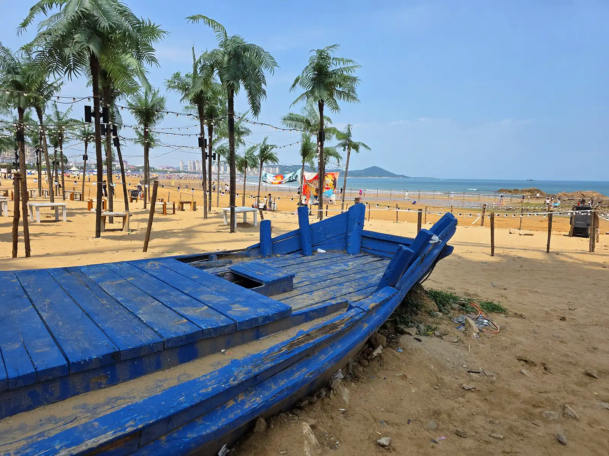
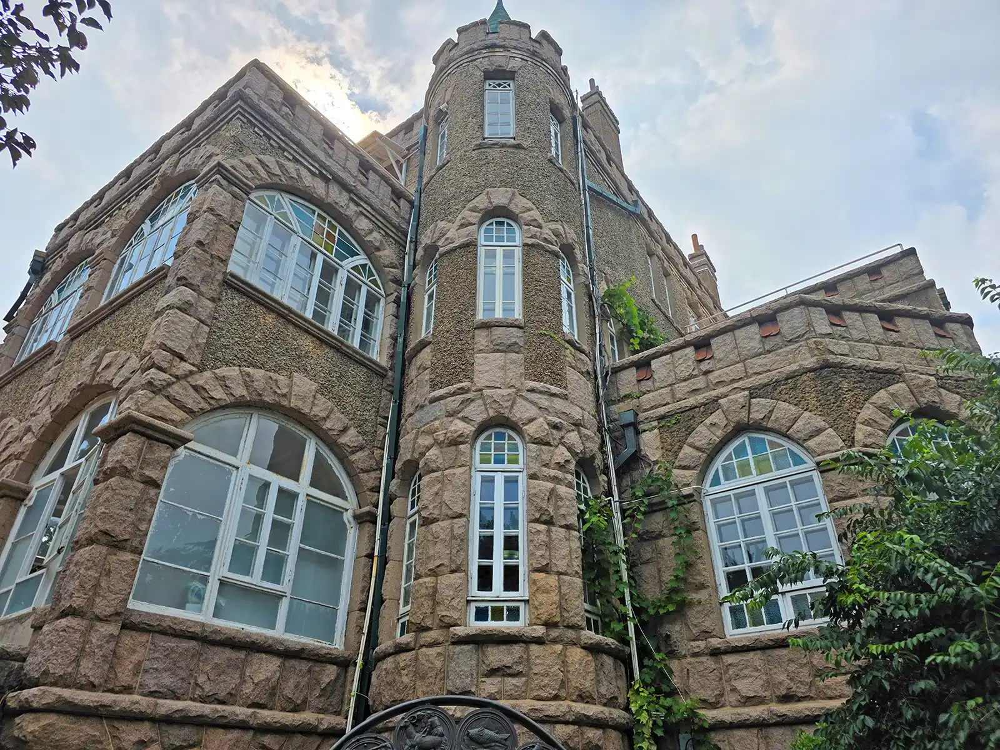
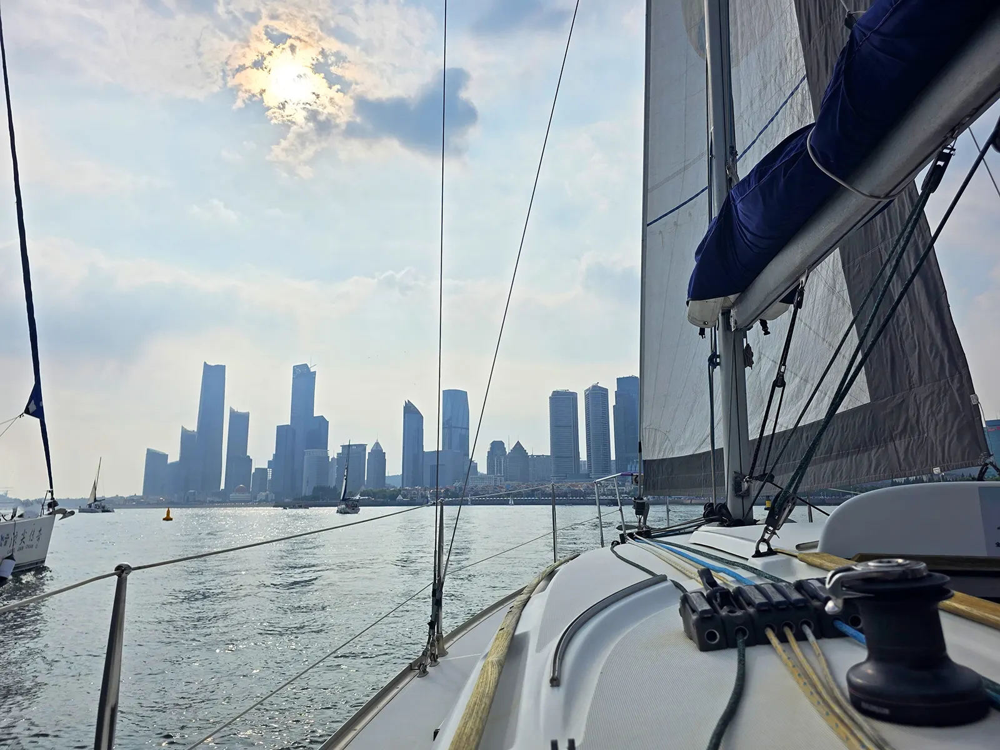
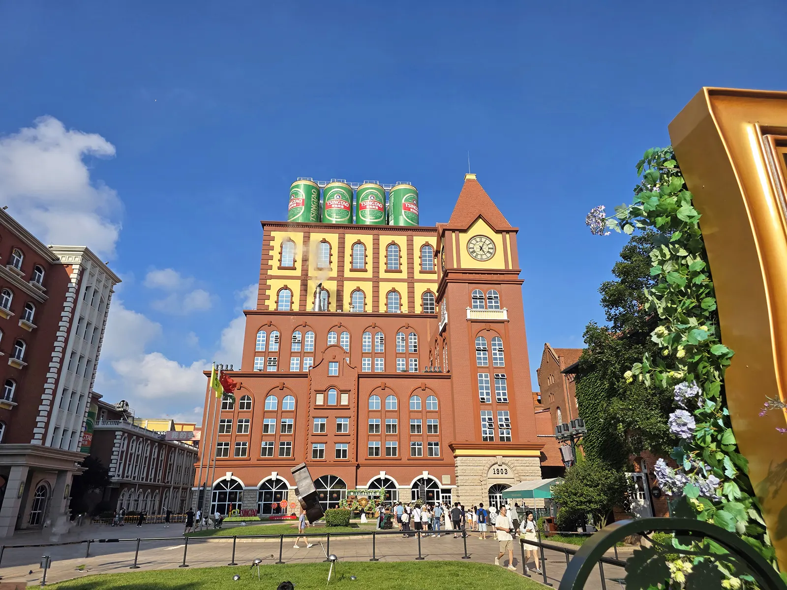
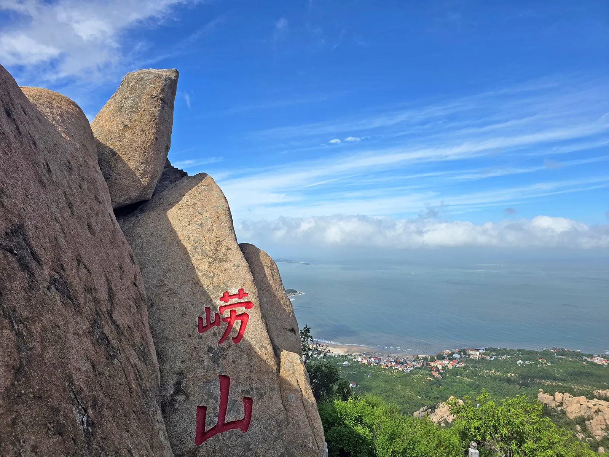
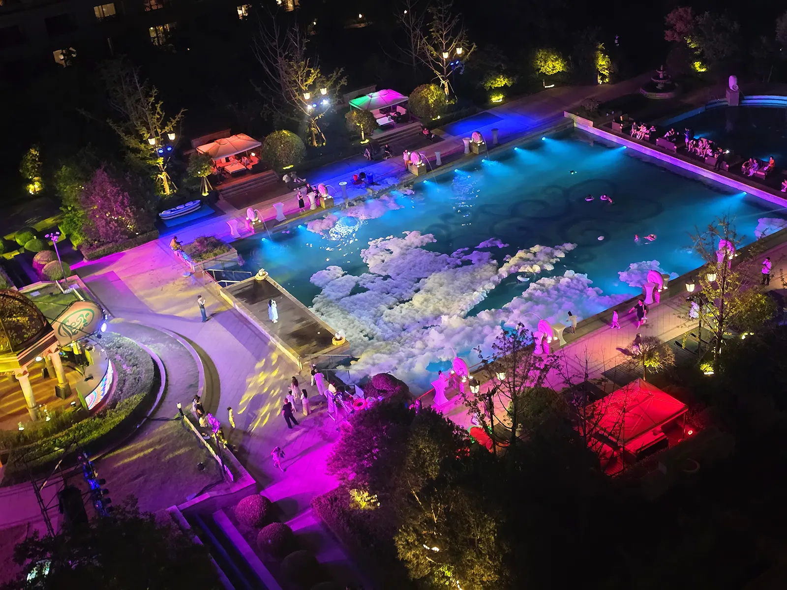

抵达青岛时，已是深夜，在希尔顿酒店入住好后，准备休闲游啦！

## Day 1 沙滩

来到青岛的第一天早晨，我们就来到了金沙滩🏖️，看着那金光闪闪的沙滩和波光鳞鳞的大海，我赶紧拿出挖沙工具，用比兔子还快的速度跑到了沙滩上，玩起了沙子。

没过多久，我们又来到了沙滩上岩石的旁边，妈妈在一旁拍照片📸，而我和爸爸在一旁用沙子和水建造湖泊。这个湖泊又小又圆，神奇的是，当我在那里面灌水时，我隐约看到沙子底下有一块岩石，这能让海水一只留在湖泊里，让建造湖泊时轻松了许多。
 
下午，我和妈妈在那里玩海浪，当我一踏进大海里，一个接着一个的海浪朝我涌来，大家尖叫起来，但是都很开兴。回家之后，因为太长时间一只被太阳晒着，妈妈的肩膀都被晒伤了，我们十分胆心她。

## Day 2 八大关

第二天一早，🦅我们又开始游玩青岛了🌺🌼🌱🍀。大家都先来到了八大关，里面最有特色的是胡蝶楼、花石楼和公主楼。

我们先来到了公主楼，它的颜色为蓝色，是八大关中别具一一格的建筑。它的设计师是一位俄国人，造型简洁又流畅，属于北欧田园风格。而公主楼这个得名是源于它要计划接待一位公主。

接下来我们又去了胡蝶楼， 它面朝大海，是一座具有折中主义风格的别墅。之所以被称为胡蝶楼，是因为当时的影星胡蝶在这里拍过一部电影🎦，名叫《劫后桃花》🌸。

最后我们来到了花石楼，它靠近大海，是八大关中颇有特色的建筑。其最初的主人名叫涞比池，所以花石楼也叫涞氏旧宅。大家叫它花石楼，是因为它由花岗岩砌成，并以滑互做装饰，融合各种建筑风格。

下午，我们坐上了帆船⛵，海风吹🌬️在脸上，十分舒服！

## Day 3 啤酒厂

来青岛的第三天终于到来了！我们匆匆忙忙地吃完了早餐，就出发去栈桥🌉了。~o(〃'▽'〃)o

没过多久，我们就来到了栈桥🌉边上，可惜人呢太多了，所以只好去下一个目的地——啤酒博物馆！！！乀(ˉεˉ乀)    啤酒博物馆是一个大而美丽的博物馆。我们先来到了博物馆中的A馆，里面有青岛啤酒的历史、酿造啤酒的原材料，比如啤酒花🌸，酵母 ，水和大麦等材料。╰(*´︶`*)╯🏵️🍞🚰🌾   

看完A馆，我们眼前出现了一口井，据说它是这里四口老井中的其中之一，在以前这里啤酒中的水都是用这些井里的水‼‼

来到博物馆的B馆，B馆中介绍了酿酒的机器，十分震撼。   

## Day 4 崂山

来青岛的旅途就要结束了。(*'へ'*)🐇🐇🐇🦐🦐🦐

这一天早晨，我们持续做了个多小时的车🚗，终于到了目的地——崂山。🥰😙🐡💐来到了崂山，我们先坐上了缆车🚡，外面的风景十分美丽，特别的是，一旁的大石头上刻着许许多多的寿字，听说是书法家们写的！终于，缆车🚡🚡🚡到站了。大家像摇过了的汽水🥤一样冲了出去，一口气登上了崂山⛰️中觅天洞的入口。

钻进觅天洞，阴冷又潮湿的感觉弥漫在了空气中，我一步一步的走在那湿透了的楼梯上，每一步都很危险。我们每一个人都心惊胆战的走着，但最终还是都出来了。我们又坐缆车🚡下山后，又去了流沙河去赶海，还捡到了许多螃蟹🦀🦀🦀🦀。

晚上回到酒店休息，次日就要回去了。
