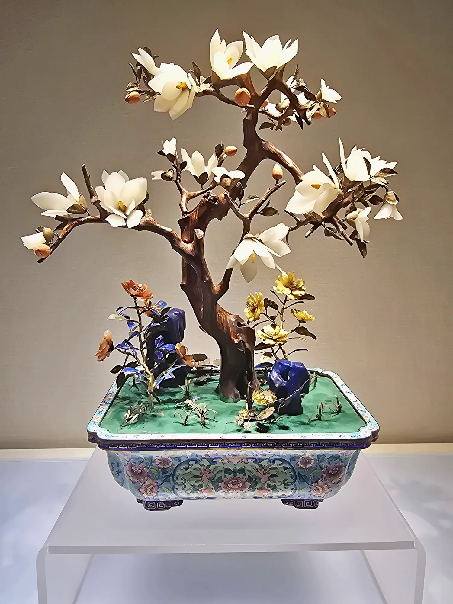
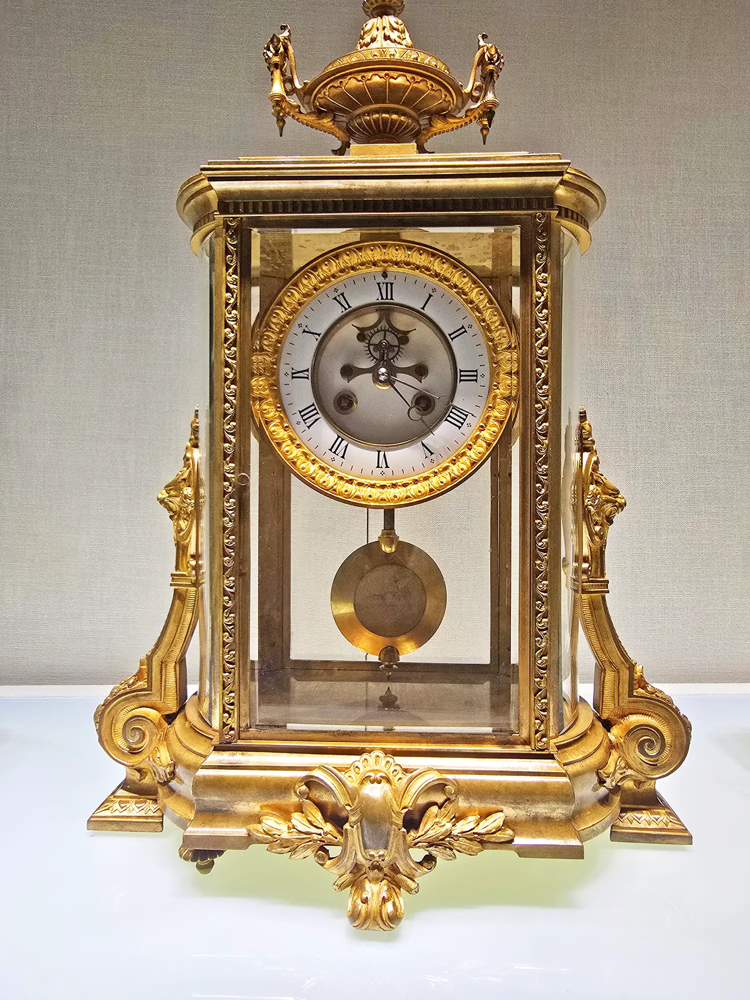
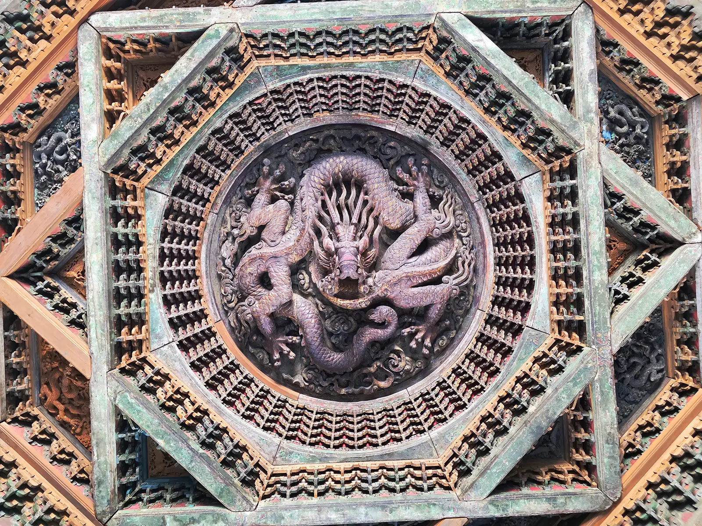
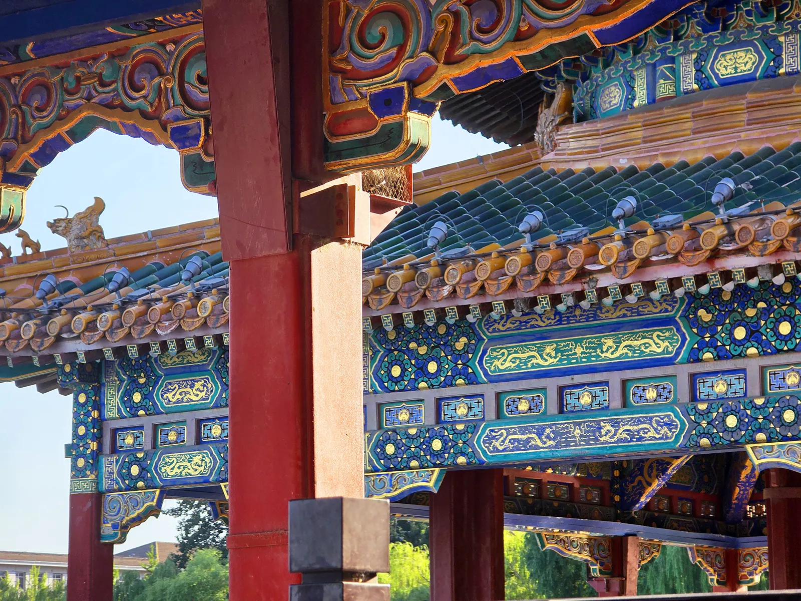
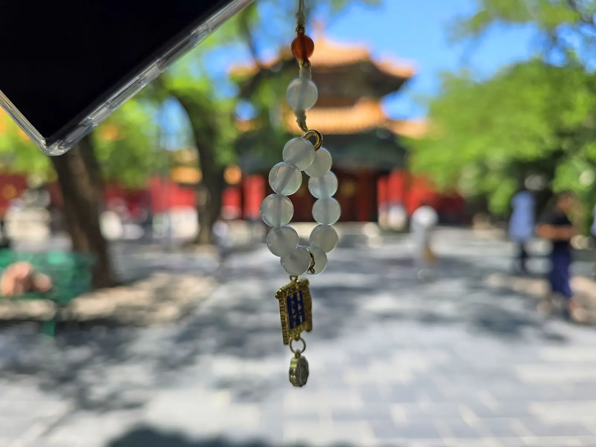
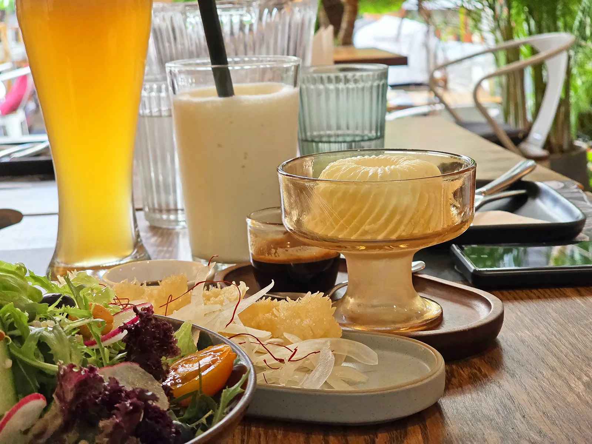
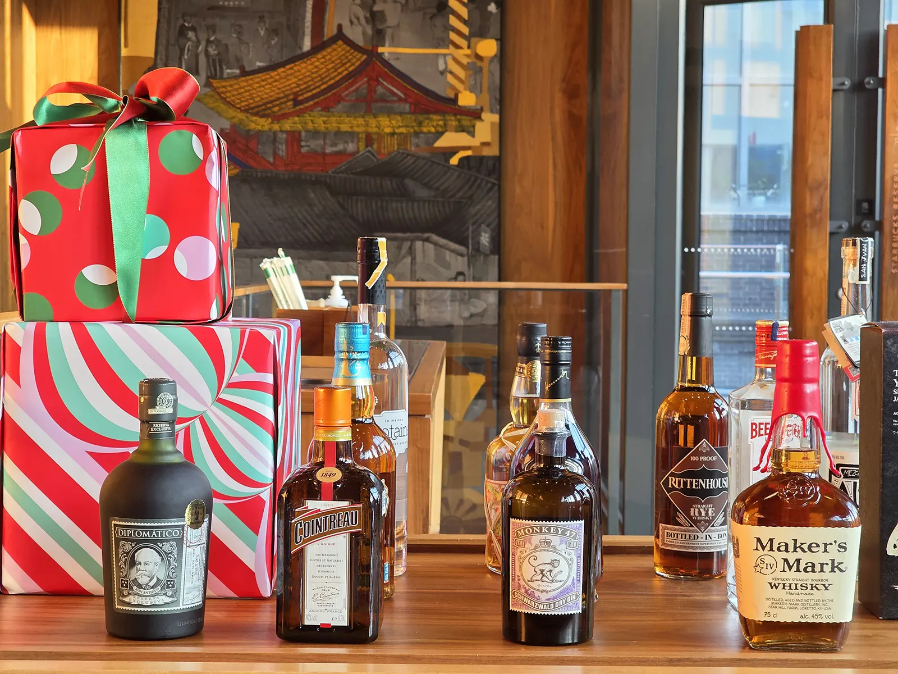

# 雍和宫

这是前几天发生的事。我想我亲爱的帅 Daddy 了，他当时在北京出差，于是我坐高铁来找他，可是他还在上班，所以我只好先来到前门大街，穿过天安门，进入紫禁城参观。我之前和 Daddy 来过很多次这里，还在他小时候和他老爸也就是我爷爷合影的地方，我们也做了一样的动作拍过照片。

但这次 Daddy 不在旁边，我穿着漂亮的小公主服，参观了这里面金碧辉煌的宫殿，有玉石做的牛，雕刻精致的翠竹盆景和精美的兰花盆景……还到里面的珍宝馆看到了很多宝物，其中有一个英国送给我们国家的钟非常好看，我站在这看了很久，里面的针在旋转，慢慢的我觉得周围也跟着旋转了起来，这时地面和旁边的东西都不见了，只有前面的这个漂亮的钟，然后都消失了，但很快前面又出现了亮光，我好像隔着前面一个玻璃又看到了前门大街。

我从口袋里摸出了一张纸条，这是 Daddy 住的康莱德酒店的便签纸，上面写着现在是清朝，要到雍和宫许愿才能重新回到现在。我还不知道这是怎么回事，突然看到 Daddy 正站在我眼前，他在玻璃外看着我里面，但不知道有没有看到我。我朝他挥了挥手，叫他快点进来，他把头伸了过来，又更靠近一些，然后他好像被吸了进来。

这时周围突然又什么都没有了，但很快我和 Daddy 掉到了一个地板上，我抬起头看到上面有个藻井，方形里套着圆形里，中间是一条神龙，正朝下看着我们。我这时正在一个宫殿里，这时我看到 Daddy 从我身旁跑到了门外，我也追了出去，前面一个小广场，旁边一个房子的正门上挂着太岁殿的牌匾。Daddy 现在穿着王爷的衣服，不知道什么时候换的，他说“好晒啊”，我突然想起纸条的事情，然后急着大叫“王爷王爷帅 Daddy，我们必须去雍和宫，不然就不好办啦！”Daddy 问我怎么回事，我也来不及说了，我就说很着急管不了那么多了，现在赶快就要过去。

Daddy 带着我一路跑了起来。我们经过了一个湖，旁边有白塔，还有许多宫殿，还有许多贴有琉璃的墙，非常好看，其中一个褐色的宫殿叫做大慈真如殿，是用很名贵金丝楠木搭建的。我们跑了很久，来到了画舫斋，我们坐在旁边休息。这里有个回廊，中间有个方形水池，我拿着一些吃的往里面扔进去喂鱼，喂了很久，后来我自己也吃了起来。我们在这里休息了很久，又和 Daddy 在这里参观了一下，还有个叫古柯庭影的苏式花园。我们走出了这里，旁边有个铁影壁，是火山石做的。

Daddy 带我继续赶路。终于我们到了雍和宫，里面的宫殿都是黄琉璃瓦、红漆木墙、飞檐斗拱。Daddy 告诉我，这里以前叫做雍亲王府，出过两位皇帝，是龙潜福地。我们来到大殿门前，Daddy 点上了几炷香，跪在殿前。我也跪在旁边，心里许着愿望，但不能说出来。等我睁开眼睛的时候，咦？周围不太一样了，多了很多游客在烧香，Daddy 的衣服也变回成他平时穿的，看来我们又回到现代啦！

Daddy 带着我走出了雍和宫，来到旁边的五道营胡同，我们在一家店里坐下来，点了一些吃的和喝的。我问 Daddy 怎么在前门大街，他说给我买了一些吴裕泰的茶饼，而且还是排队第一个，我很喜欢吃。晚上我们回到酒店，在行政酒廊吃的晚饭。今天走了很多路，但是很开心，晚上又可以抱着 Daddy 睡觉啦。​

