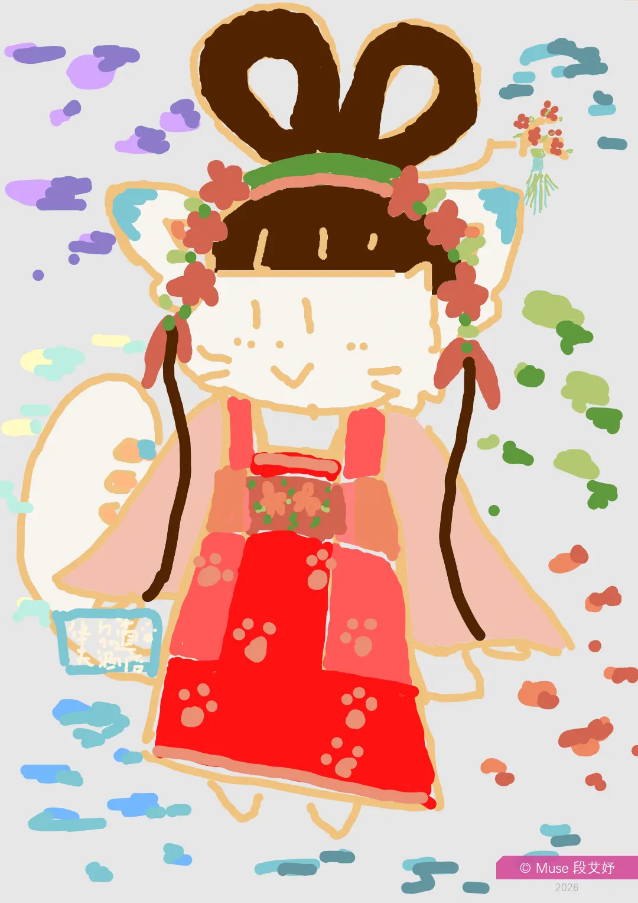
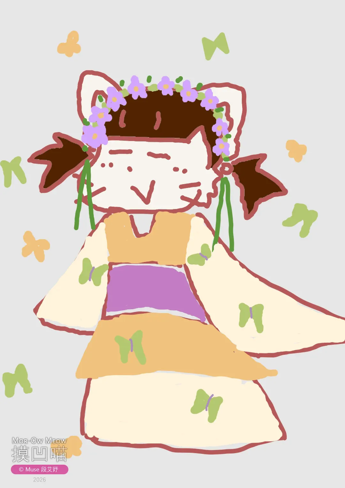
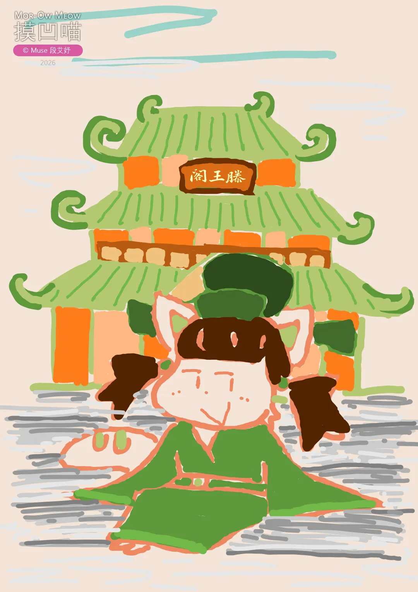
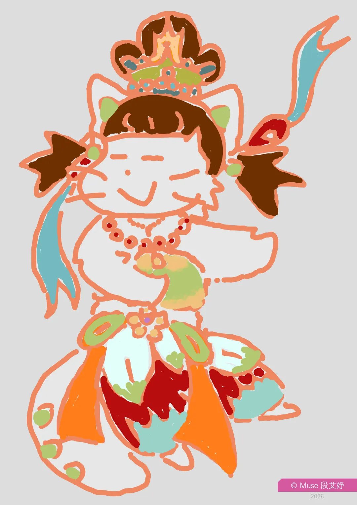
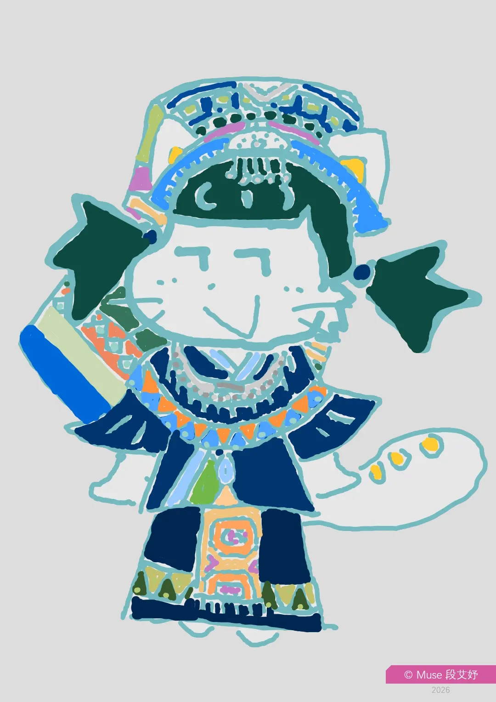
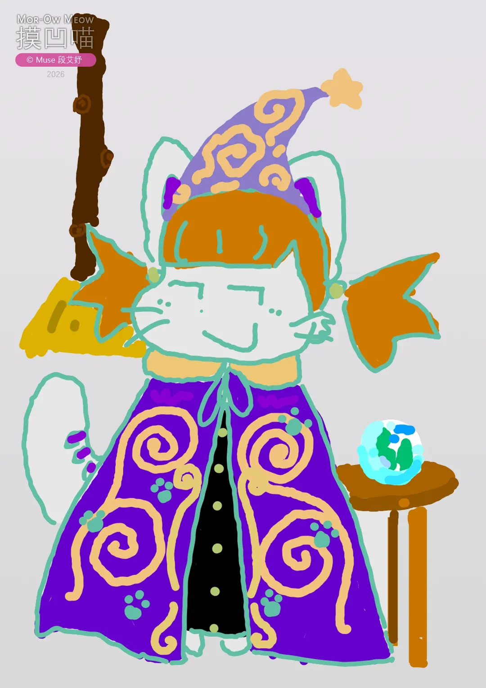
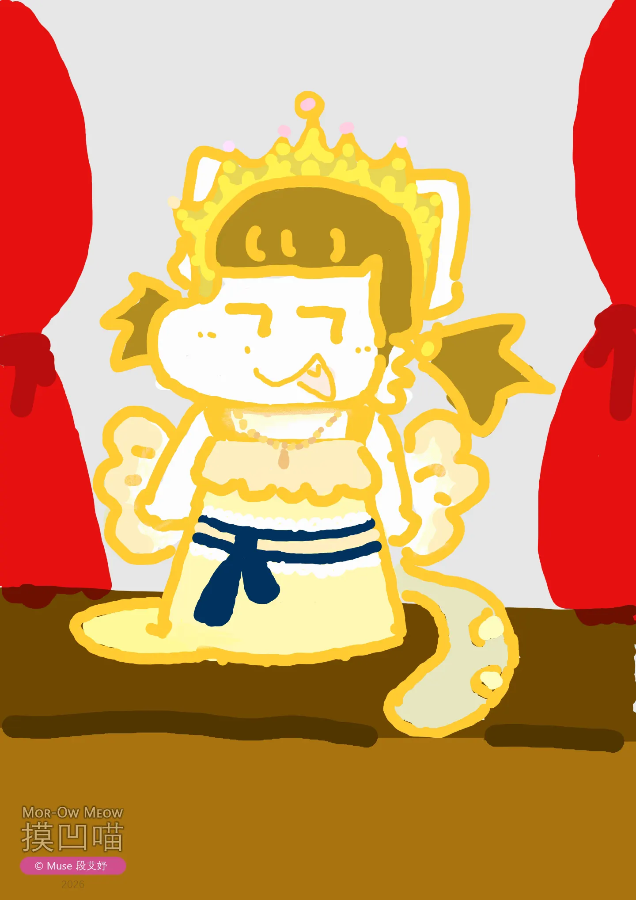

如之前预告，《摸凹喵之古装与民族服饰》主题来啦！💐

↑ 《大红华丽古装摸凹喵》：中国经典喜庆大红色、飘逸的衣袖、优美的辫子。（这幅画在之前其实出现过噢）

↑ 《蝴蝶翩翩古装摸凹喵》：仙女下凡！

↑ 《摸凹喵在滕王阁》：在下正是才女一枚。（这幅画在之前其实出现过噢）

↑ 《摸凹喵敦煌》：妙曼舞姿、飘逸衣裙，摸凹喵飞天正在你的眼前。

↑ 《土家族摸凹喵》：毕兹卡（Bifzivkar）来也！

↑ 《摸凹喵巫师》：天灵灵地灵灵~~~

↑ 《欧洲贵族摸凹喵》：欧洲17世纪的公主，正在参加宫廷舞会。

未来还有更多，敬请期待哟。
