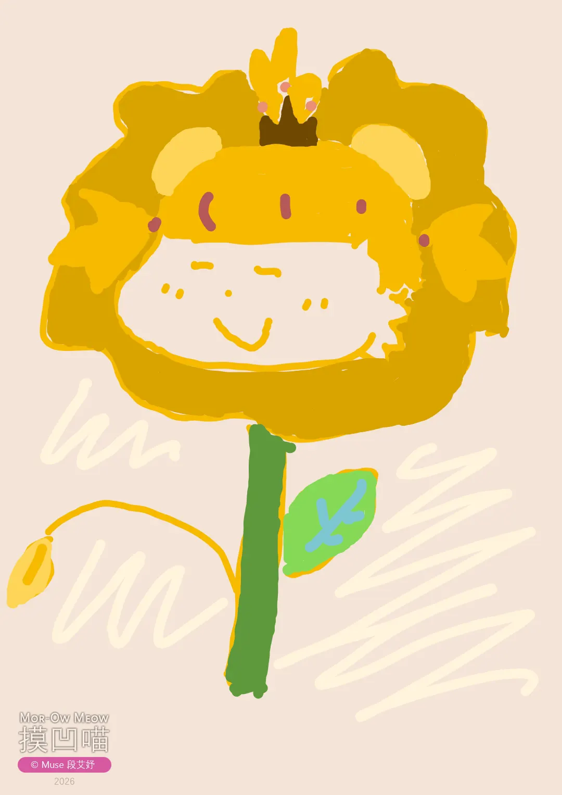
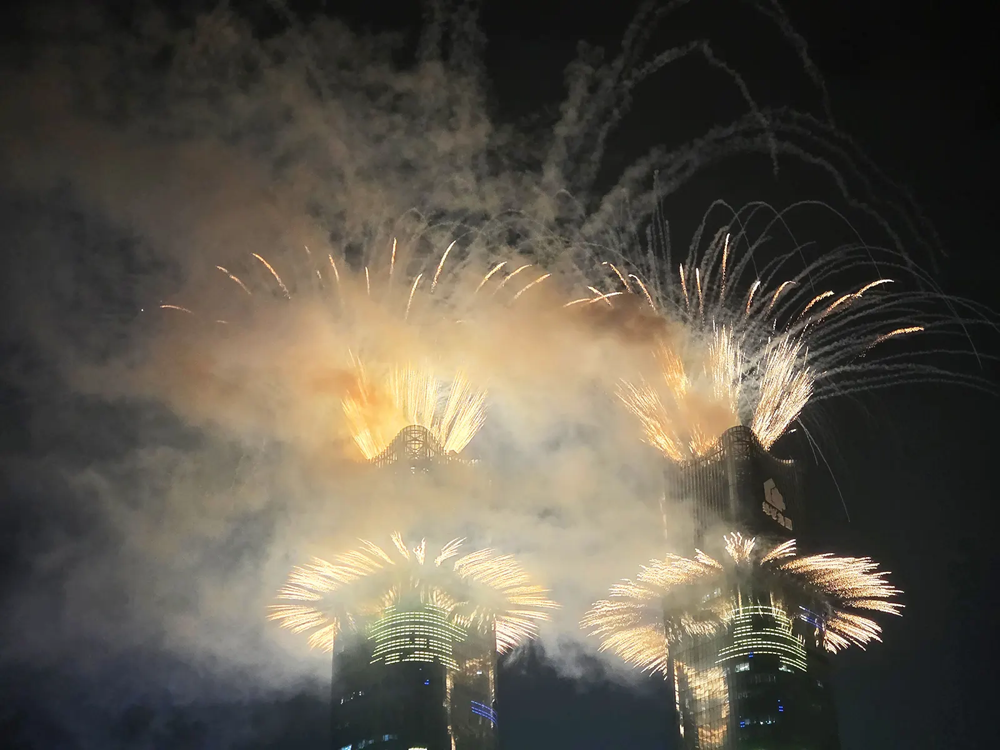
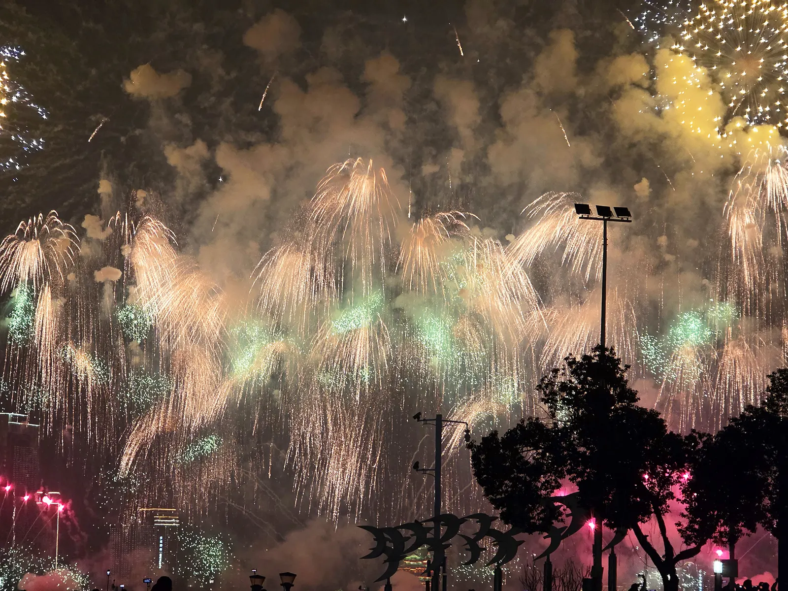
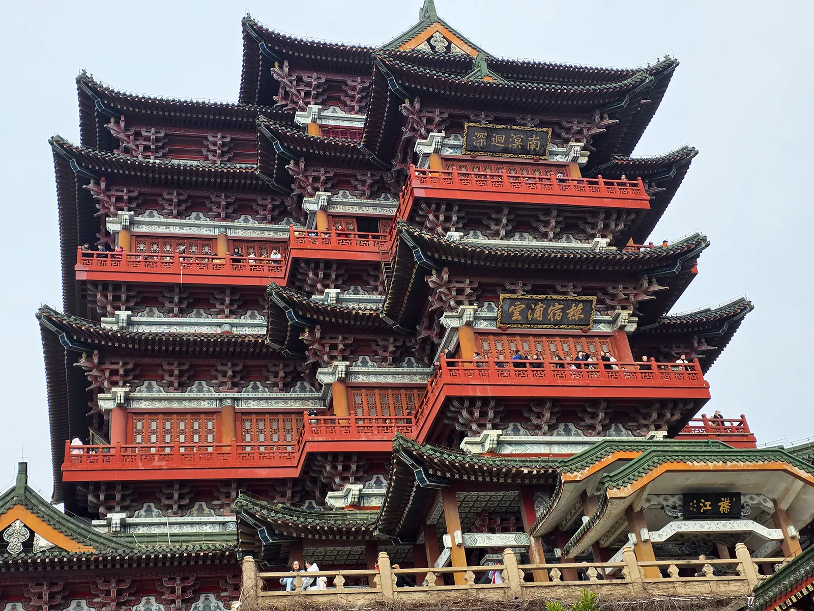
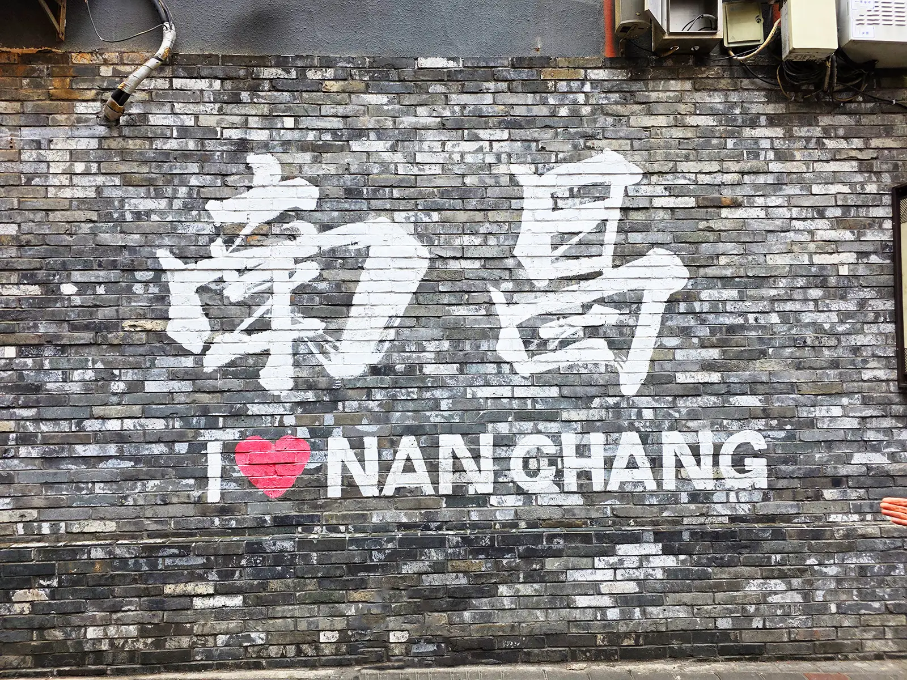
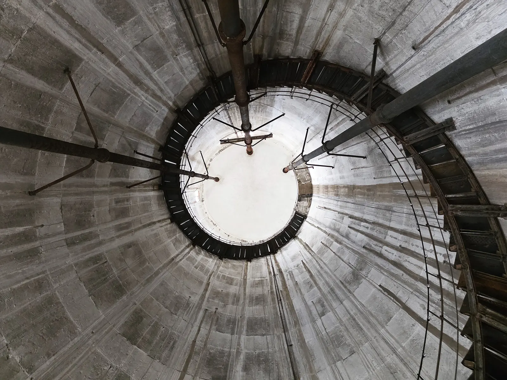
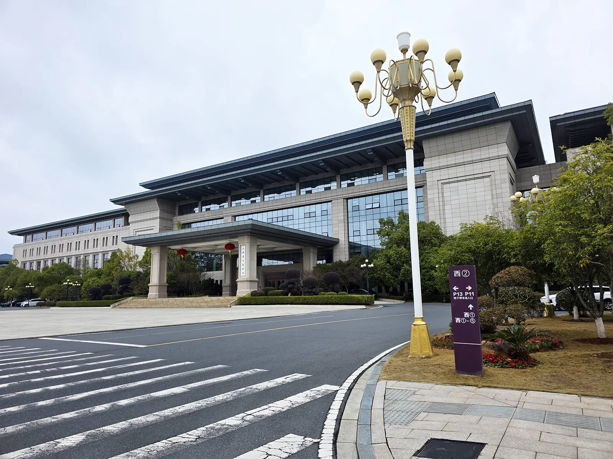
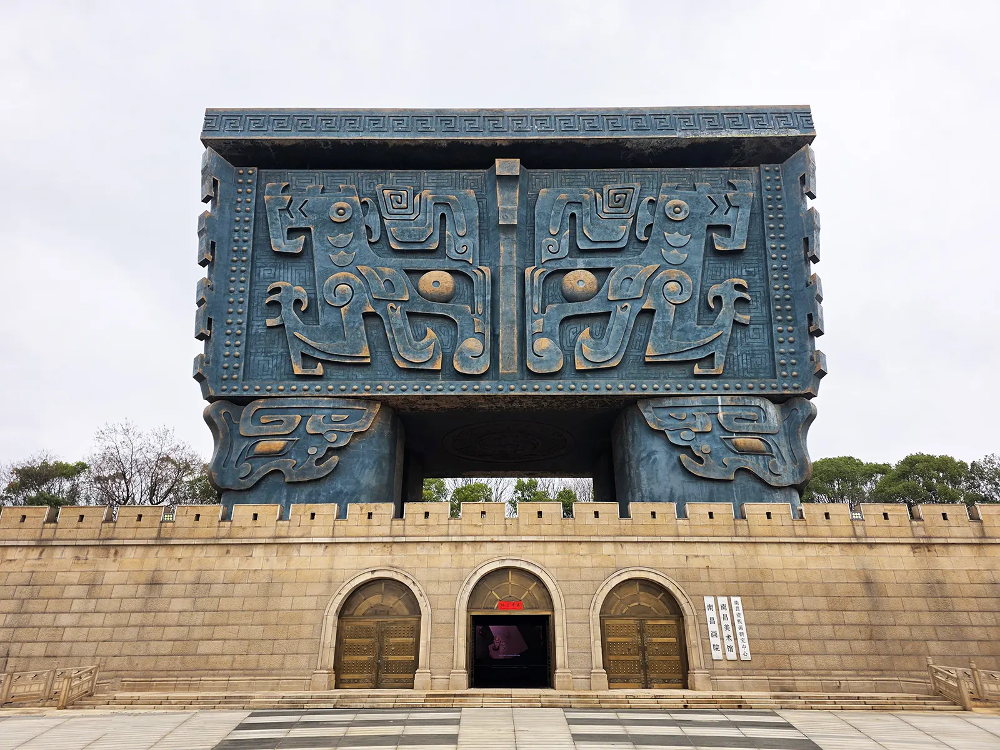
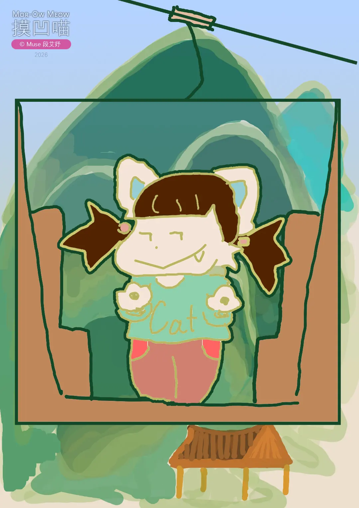
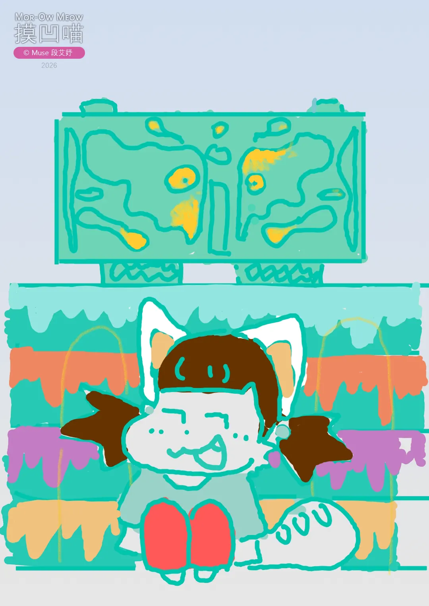

# 马年快乐

- Muse 原创《摸凹喵》（Mor-Ow Meow）新春想象系列上新啦 💜🤎
- 快快跟随我的脚步，云游南昌过大年！

## 临近新年

新年快乐！恭喜发财，红包拿来。​过年前的这3天，哎，​懒得写了，简单说说吧，这几天依次：

1. 磨盘山、万寿宫。
2. 云端索道。
3. （除夕）就是这天啦～新年快乐！！

祝大家一马当先，福气满满!

☆ __《摸凹喵》系列分享__

> 分享一些摸凹喵给大家吧~~~

↑ _《乖乖可爱摸凹喵》：摸凹喵可爱乖乖。_

还有动物系列呢。

↑ _《摸凹喵花豹》：啊呜~~~_

↑ _《摸凹喵花朵狮》：似狮，似花，似微笑。_

## 跨年

今年跨年，我又熬夜见证了！而后大年初一的晚上，还在红谷滩广场看了大型焰火表演，非常壮观。🎆

☆ __《摸凹喵》系列上新__

生肖主题来啦，快快收好摸凹喵！

↑ _《摸凹喵彩虹马》：阳光彩虹小白马，滴滴哒滴滴哒。哈哈！唱起了大张伟老师的歌~~~ 祝大家马年大吉！_

另外，再附赠去年和前年的吧~~

↑ _《摸凹喵蛇》：丝丝~~~_

↑ _《摸凹喵龙》：我是小神龙~~~_

## 南昌人文

- __滕王阁__

  

  豫章故郡，洪都新府，星分翼轸，地接衡庐…落霞与孤鹜齐飞，秋水共长天一色……你可能不知道，我能飞快地将《滕王阁序》背出来，就因为几年前来这的时候得知，如果能背出来就能免门票。

- __大士院__

  

  此处烟火气息浓厚。

- __江纺__

  

  以前的工业园区改造为现在的网红打卡点。

- __江西省委省政府__

  

  这是我第二次来这，这个地方非常宏大整齐，令我想到了之前去过的青瓦台。

- __南昌画院__

  

  在红角洲，江西省政府旁，有一个巨大的鼎，那是南昌画院。对画画非常感兴趣的我，自然也要去参观一下啦。

☆ __《摸凹喵》系列上新__

> 🎡 景点主题 ~~

↑ _《摸凹喵坐缆车》：在湾里来回坐了一次非常长的缆车——云端索道。_ 🚠

↑ _《摸凹喵在滕王阁》：梦回大唐。_ 🏛️

↑ _《摸凹喵与鼎》：壮观奇特。_ ⛰️

## 警官

【彩蛋】你们知道吗？我的奶奶是一名警察干部，英姿飒爽。哈哈，我也英姿飒爽！

☆ __《摸凹喵》系列上新__

> 😎 角色主题 ~~

↑ _《摸凹喵警官》：代表着正义与美貌并存，警花来也！_ 👮‍♀️

---

## 附：滕王阁序

> 别名《秋日登洪府滕王阁饯别序》，创作于公元675年，在今南昌。

[唐] 王勃

豫章故郡，洪都新府。星分翼轸，地接衡庐。襟三江而带五湖，控蛮荆而引瓯越。物华天宝，龙光射牛斗之墟；人杰地灵，徐孺下陈蕃之榻。雄州雾列，俊采星驰，台隍枕夷夏之交，宾主尽东南之美。都督阎公之雅望，棨戟遥临；宇文新州之懿范，襜帷暂驻。十旬休假，胜友如云；千里逢迎，高朋满座。腾蛟起凤，孟学士之词宗；紫电清霜，王将军之武库。家君作宰，路出名区；童子何知，躬逢胜饯。

时维九月，序属三秋。潦水尽而寒潭清，烟光凝而暮山紫。俨骖騑于上路，访风景于崇阿。临帝子之长洲，得天人之旧馆。层峦耸翠，上出重霄；飞阁流丹，下临无地。鹤汀凫渚，穷岛屿之萦回；桂殿兰宫，即冈峦之体势。

披绣闼，俯雕甍。山原旷其盈视，川泽纡其骇瞩。闾阎扑地，钟鸣鼎食之家；舸舰弥津，青雀黄龙之舳。云销雨霁，彩彻区明。落霞与孤鹜齐飞，秋水共长天一色。渔舟唱晚，响穷彭蠡之滨；雁阵惊寒，声断衡阳之浦。

遥襟甫畅，逸兴遄飞。爽籁发而清风生，纤歌凝而白云遏。睢园绿竹，气凌彭泽之樽；邺水朱华，光照临川之笔。四美具，二难并。穷睇眄于中天，极娱游于暇日。天高地迥，觉宇宙之无穷；兴尽悲来，识盈虚之有数。望长安于日下，目吴会于云间。地势极而南溟深，天柱高而北辰远。关山难越，谁悲失路之人；萍水相逢，尽是他乡之客。怀帝阍而不见，奉宣室以何年。

嗟乎！时运不齐，命途多舛；冯唐易老，李广难封。屈贾谊于长沙，非无圣主；窜梁鸿于海曲，岂乏明时？所赖君子见机，达人知命。老当益壮，宁移白首之心？穷且益坚，不坠青云之志。酌贪泉而觉爽，处涸辙以犹欢。北海虽赊，扶摇可接；东隅已逝，桑榆非晚。孟尝高洁，空余报国之情；阮籍猖狂，岂效穷途之哭！

勃，三尺微命，一介书生。无路请缨，等终军之弱冠；有怀投笔，慕宗悫之长风。舍簪笏于百龄，奉晨昏于万里。非谢家之宝树，接孟氏之芳邻。他日趋庭，叨陪鲤对；今兹捧袂，喜托龙门。杨意不逢，抚凌云而自惜；钟期既遇，奏流水以何惭？

呜呼！胜地不常，盛筵难再；兰亭已矣，梓泽丘墟。临别赠言，幸承恩于伟饯；登高作赋，是所望于群公。敢竭鄙怀，恭疏短引；一言均赋，四韵俱成。请洒潘江，各倾陆海云尔。　

滕王高阁临江渚，佩玉鸣鸾罢歌舞。

画栋朝飞南浦云，珠帘暮卷西山雨。

闲云潭影日悠悠，物换星移几度秋。

阁中帝子今何在？槛外长江空自流。
