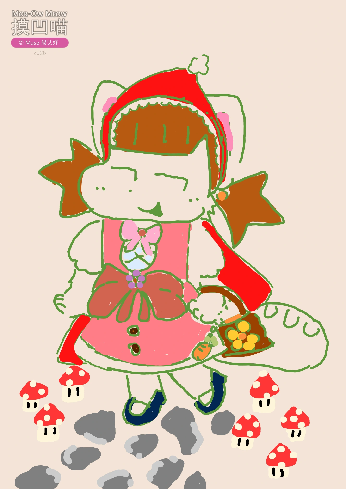
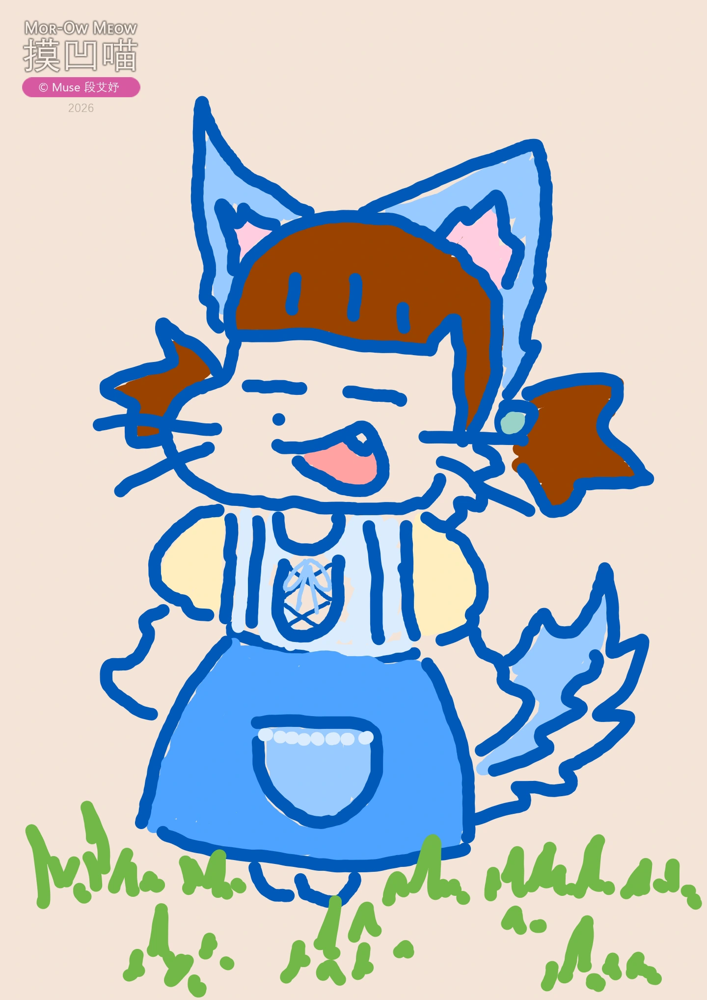
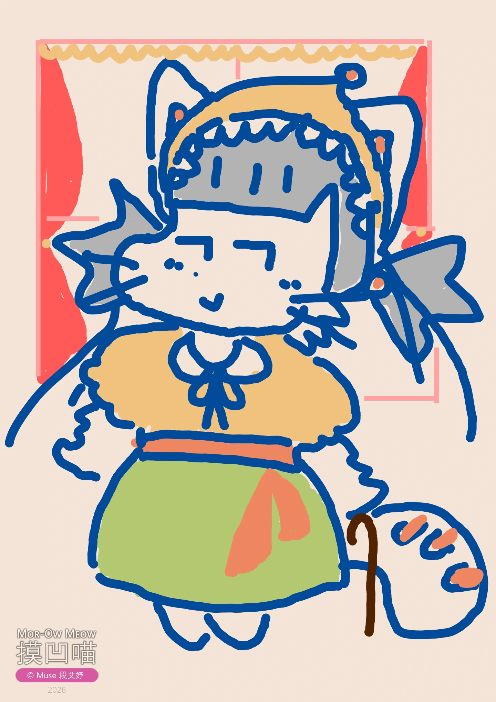
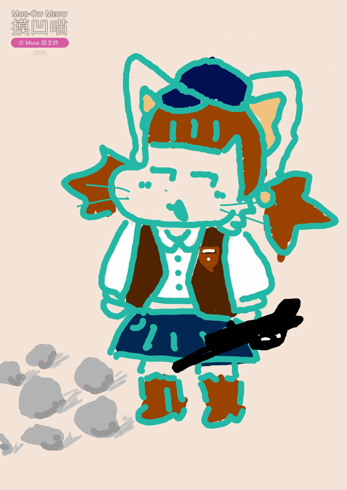

相信大家对《格林童话》中的《小红帽》故事都很熟悉吧，那么这次由《摸凹喵》给大家深情演绎一段吧！

从前有个可爱的小姑娘人见人爱，尤其是她奶奶特别喜欢她，小姑娘想要什么，奶奶就给她什么。一次，奶奶送给她一顶用丝绒做的小红帽，戴在头上正合适，从此她天天戴着，于是大家便叫她“小红帽”。

↑ _《摸凹喵小红帽》_

有一天，妈妈让小红帽给生病了的奶奶送去一块蛋糕和一瓶葡萄酒，并叮嘱她路上小心，要走大路，到奶奶家后也别忘了说“早上好”，不要一进屋就东瞧西瞅。奶奶住在村子外面的森林里，离小红帽家有很长一段路。

↑ _《吃小红帽奶奶的摸凹喵大灰狼》_

路上，小红帽刚进森林就遇到了一条大灰狼，可小红帽不知大灰狼是好是坏。大灰狼问小红帽去哪，小红帽便如实告诉了大灰狼，还说明了奶奶的具体住址。大灰狼心想着老奶奶和小红帽一定很美味，于是有了一个坏坏的计谋，并让小红帽去周围采一些鲜花送给奶奶。

↑ _《小红帽的摸凹喵奶奶》_

大灰狼跑到小红帽的奶奶家，声称自己是来送吃的的小红帽。没力气的奶奶叫它进来，谁想到大灰狼一进来就冲到床前，把奶奶吞进肚子里。过了一会儿，采完花后的小红帽来了。可小红帽看到奶奶家的门开着，觉得很奇怪，并且一进屋里就有异样的感觉。

小红帽大声叫“早上好！”可是没有听到回答。她看到奶奶躺在床上，帽子拉得低低的，把脸都遮住了，样子很奇怪，于是问“哎，奶奶，你的耳朵怎么这样大呀？”

“为了更好地听你说话呀，乖乖。”

“可是奶奶，你的眼睛怎么这样大呀？”

“为了更清楚地看你呀，乖乖。”

“奶奶，你的手怎么这样大呀？”

“可以更好地抱着你呀。”

“奶奶，你的嘴巴怎么大得很吓人呀？”

“可以一口把你吃掉呀！”大灰狼说完就从床上跳起来，把小红帽吞进了肚子，然后呼呼大睡起来。

↑ _《救助小红帽和奶奶的摸凹喵猎人》_

这时一位猎人碰巧从屋前走过，心想这老奶奶怎么鼾声这么大，不会有什么问题吧，走进一看竟发现是大灰狼！“你这老坏蛋，我找了你这么久，没想到在这。”猎人心想着，正要开枪，突然想到可能老奶奶在它肚子里，于是找了个剪刀把大灰狼肚子剪开。刚剪两下，就看到红色的小帽子，猎人又剪了两下，小红帽便跳了出来，“吓坏我了，狼肚子里黑漆漆的。”接着，小红帽的奶奶也被救了出来。

后来，他们搬了几个石头放进大灰狼的肚子里。大灰狼醒后想逃走，可石头太重了，于是就摔倒在地。完。
