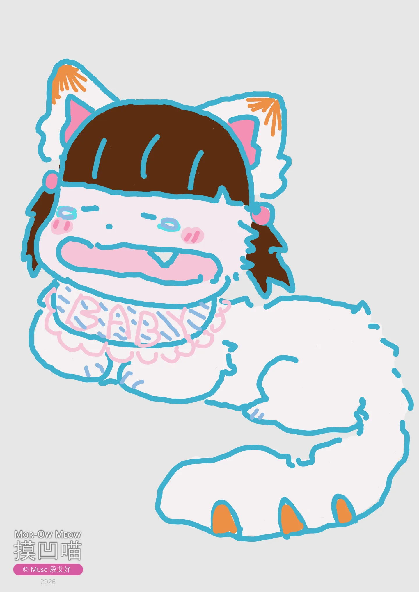
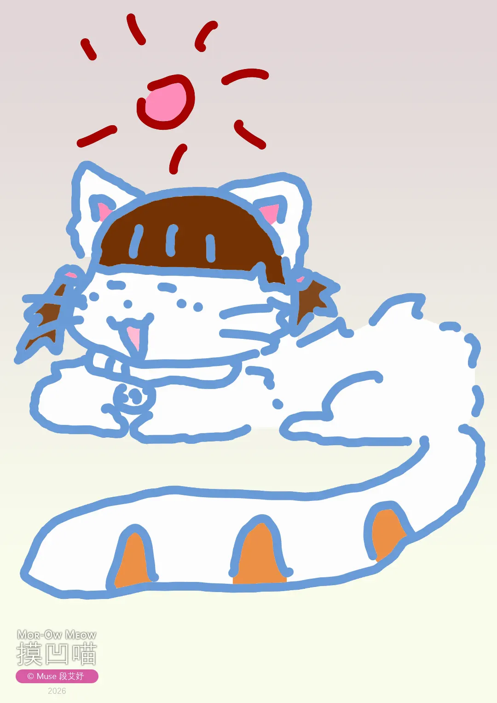
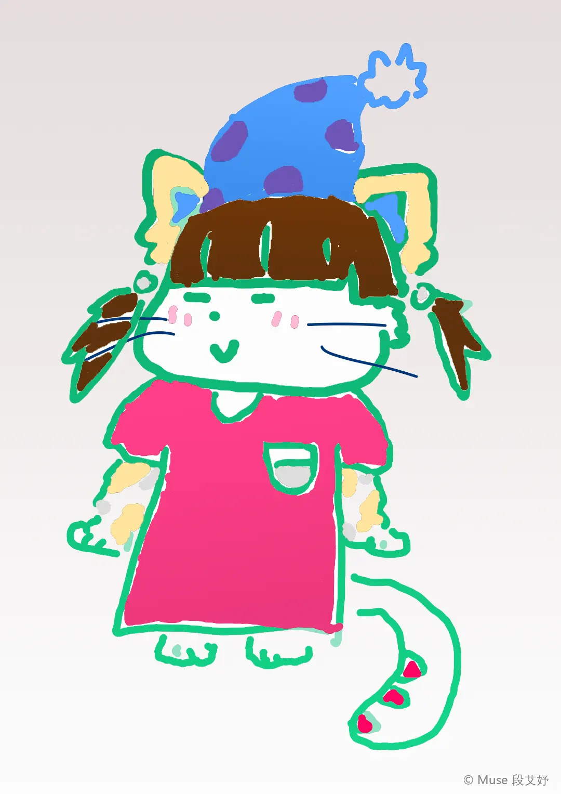
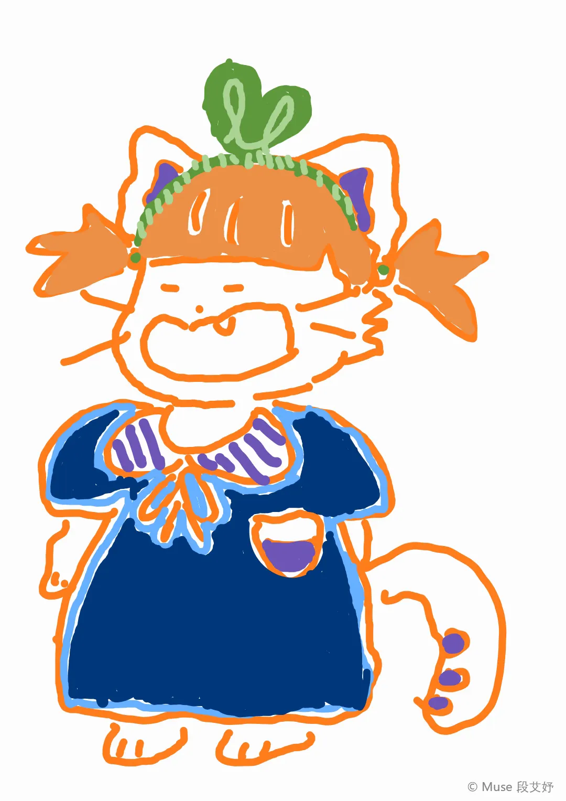
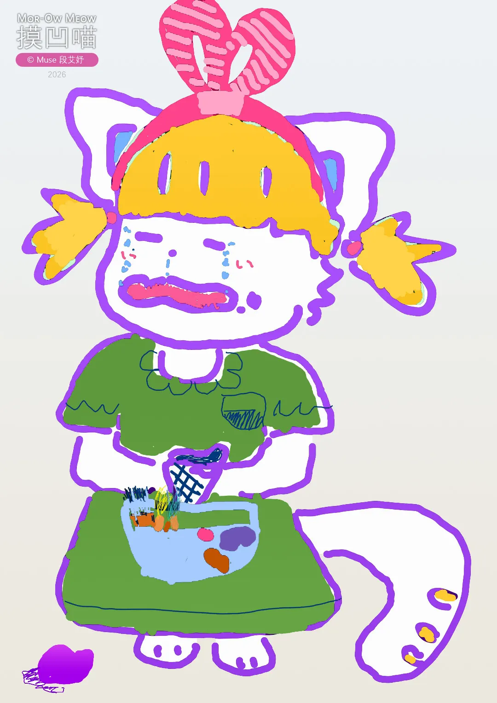
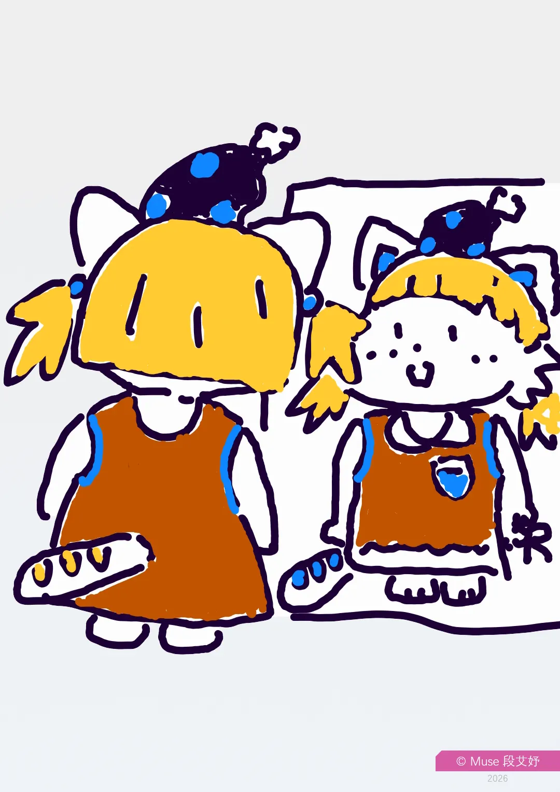
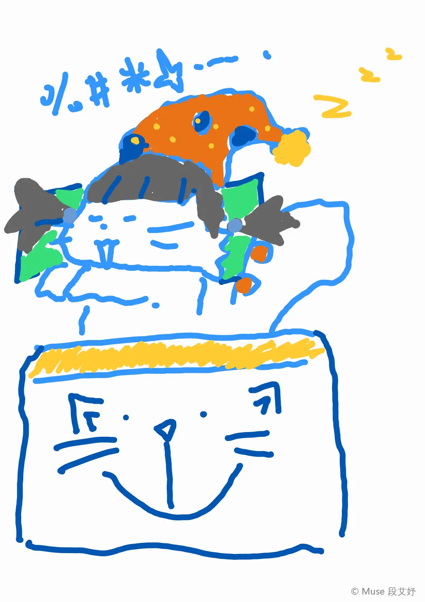
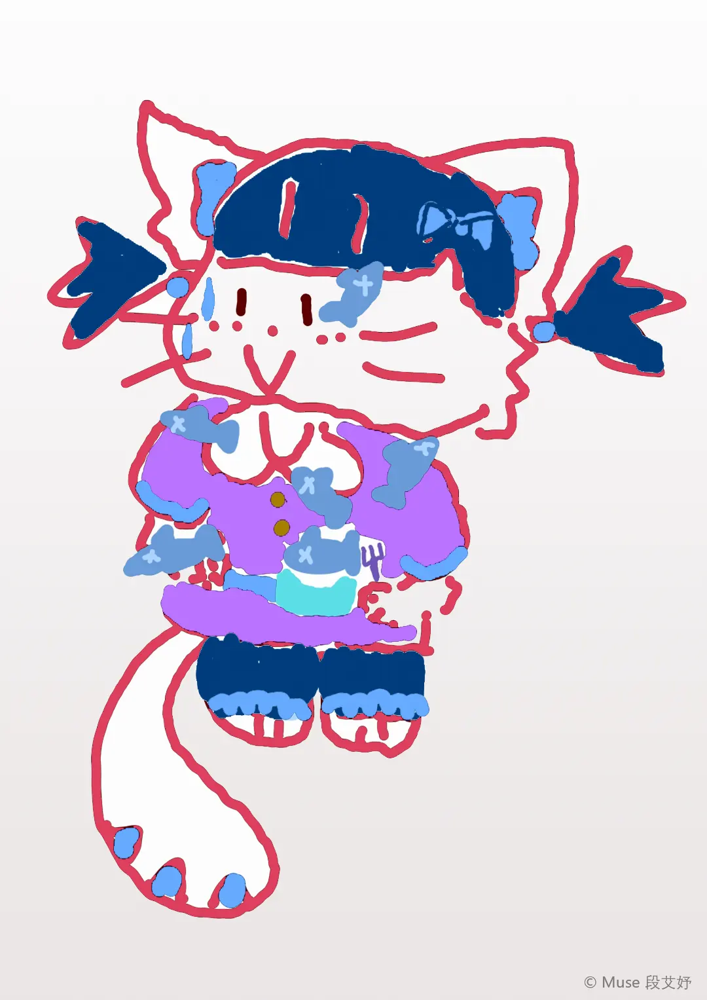
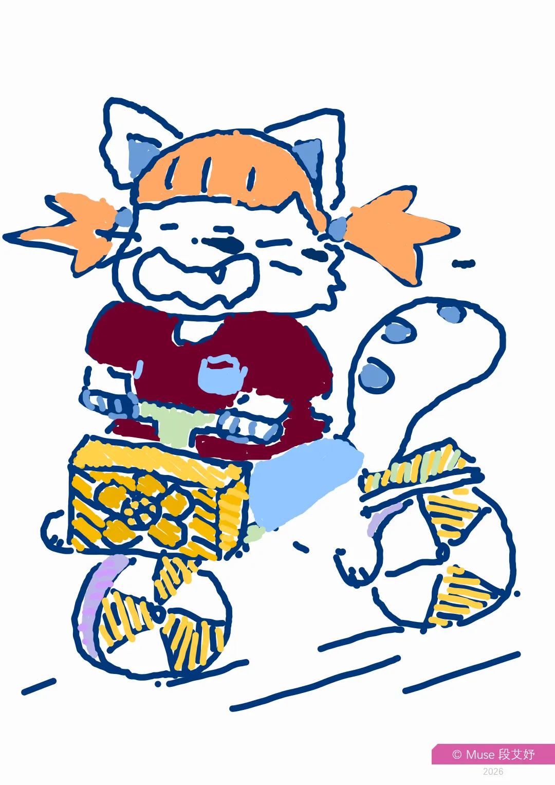

大家好，我是 Muse，爱好画画，现在十岁半。古人云，十岁不愁。于是，当当当当，在2026年尹始，我的第一个系列画作 IP——《摸凹喵》诞生啦！

## 诞生

↑ _《摸凹喵诞生》_

↑ _《晒太阳的摸凹喵》_

↑ _《居家日常摸凹喵》_

这是一只可爱的小猫猫，有着齐刘海和双马尾，眼睛不大、嘴巴可小可大有弹性，是不是萌萌哒，是不是超有趣，是不是很像小时候的我？

## 百变多可爱

↑ _《咧嘴笑摸凹喵》：摸凹喵喜欢穿着格式各样的漂亮衣裳，带着头饰，快乐地出现在大家面前。_

↑ _《摸凹喵的冰淇淋掉了》：但也有伤心的时候。_

↑ _《摸凹喵照镜子》：每天出门前，照照镜子，发现自己还是那么美。_

↑ _《摸凹喵的美梦》：困了，就往床上一躺，做个好梦！来日又是活蹦乱跳的一天。_

## 持续更新ing

> 我会继续上新更多摸凹喵的作品的，敬请关注我的官网和其他授权转载社交媒体噢~~~

↑ _《摸凹喵爱吃鱼》_

↑ _《摸凹喵骑车》_

## 创作 FAQ

- `Q1` 这是用什么画的？

  `A` 🖊 我在手机上，拿着手写笔，用自带的《三星笔记》app（与 Microsoft OneNote 相连）画的，用的就是笔刷工具，电子手绘。也许未来有一天，会用更专业的 app 来画，但依然会保持相当程度原汁原味的手绘感。

- `Q2` 图画的大小呢？

  `A` 📃 这是数码绘画，尺寸比例与 A4 纸张类似，方向是竖着的，也就是横宽纵长比例为1比根号2（1:√2 或 1:1.414）并精确到完整像素。

- `Q3` 怎么设计出的这个形象？

  `A` 🐱 这很像我，就是这么设计出的这个形象。这些画作，很多都是我随看随想而来的，所谓艺术来源于生活。

- `Q4` 什么时候开始的？

  `A` 📅 2026年1月份摸凹喵诞生！此时已有多幅画作啦。

- `Q5` 那……

  `A` ♥️ 啊今天采访结束，谢谢大家！

## 不同语 相同音

| 语言 | 名字 | 发音或释意 |
| -------- | ---------- | ---------- |
| 简体中文 | 摸凹喵 | Mōāomiāo |
| 繁体中文 | 摸凹喵 | ㄇㄛ ㄠ ㄇㄧㄠ |
| American English | Mor-Ow Meow | /mɔ aʊ miˈaʊ/ |
| British English | Mor-Ow Meow | /mɔː aʊ mjaʊ/ |
| Français | Moh-Aou Miaou | |
| 日本語 | 摸凹喵 | モル オウ ニャー |
| 한국어 | 모오 미야오 | （摸凹喵） |

💡 _名字的由来：_ 摸凹谐音猫的汉语拼音拼读，同时又取自摸摸和凹造型两词，最后加上个拟声字喵。
