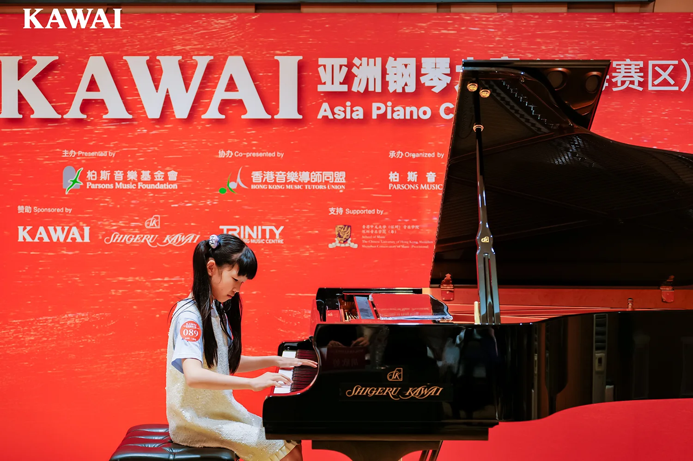
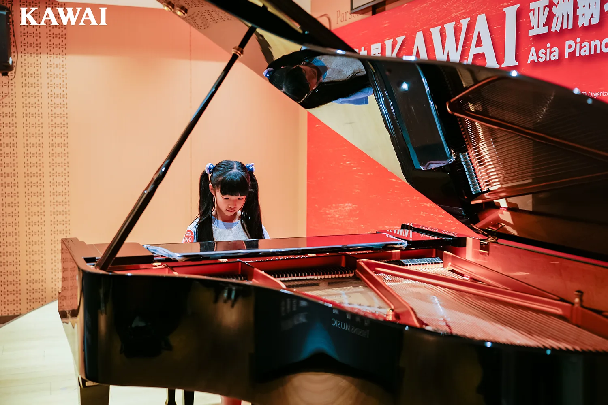

我的心“砰砰”地跳，手不听使唤地总弹错音，一颗颗如豆子般大的汗珠从我脸上掉落。我的手放在钢琴键上，满是手汗，评委用不敢相信的眼神看着我，在评分表上画了个大大的`0`字。

我猛地睁开眼，原来，这是一场梦啊。我看着天花板，想着明天的钢琴比赛，想着想着我又睡着了。

今天早晨，我顶着两个大大的黑眼圈，穿着华丽的礼服，来到了比赛现场。比赛马上就开始了，我是89号，是这一场倒数第2个演出的。

第一个小朋友上场了，接着是第二个、第三个。数字离89越来越近，我紧张地抠起了手。到第88号小朋友演出时，我突然心想：咦，怎么回事，我的手怎么有点湿？于是我低下了头，看了看我的手臂。原来，是我太紧张了，都抠出血了。可我还没来得及擦，主持人就已说出“89号请上台”，我只好无奈地走上舞台，在三角钢琴前，准备坐下表演。可这次演出很悲惨，正当我坐下时，我的大门牙竟然不小心撞到了钢琴，疼得我龇牙咧嘴。

不过还好，这次表演格外精彩，连评委都在跟着节奏摇头晃脑地听着。

这真是一次悲惨而又精彩的演出啊！这一次我相信我能得一等奖！如果不行，那二等奖也可以！

---

