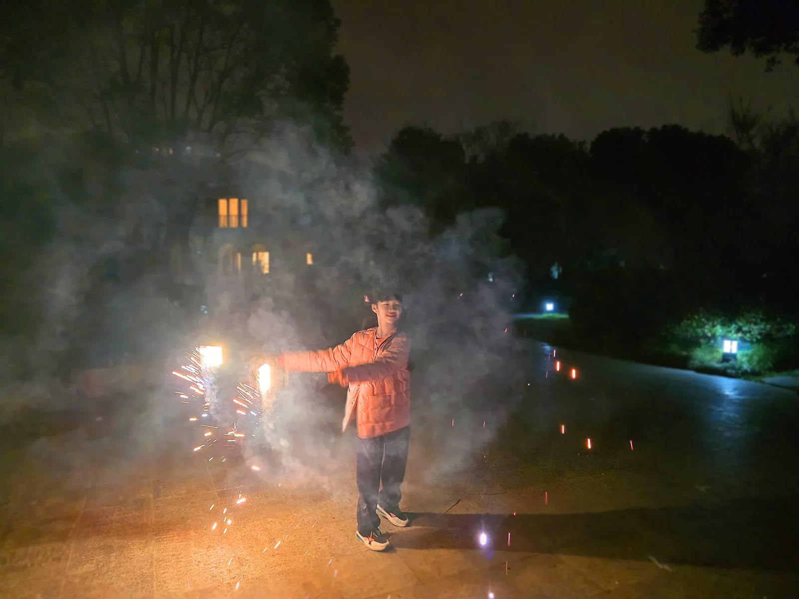
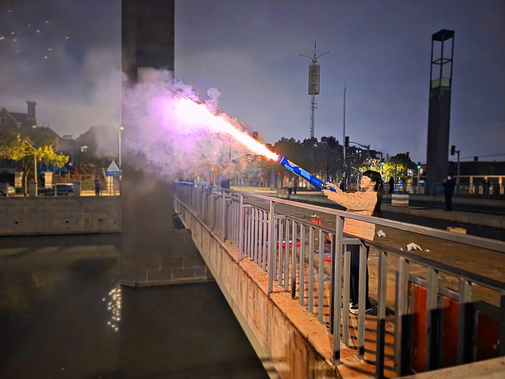

元宵是一家人团聚的日子，而我们家也一样，坐在桌前、看着电视、吃着美味的晚餐。

就在这时，我突然想到还有烟花在阳台上。那些本来是春节放的，但因为又要表演、又要旅游，实在太忙了，就一直没放，现在还在阳台“睡大觉”呢！于是，我们吃完晚餐，就来到小区的广场里，放起烟火来。

打火机是点烟花必不可少的东西，可我们家由于不怎么用得到，所以只有一个买蛋糕送的劣质打火机。一开始我们点的是大仙女棒，一直点不着，后来我发现小仙女棒更好点，于是我就先点小的，再将小的的火花点着大的。

一开始我是单手辉，后来我创新了其他手法，比如双手挥、转圈挥和胡乱挥。

不过在小区里放太无聊了，于是我们就在江边开始放已经“睡”了最久的加特林。我们小心地点上加特林，忽然，只听“啪”的一声，美丽的烟花从空中绽放，又缓缓落下，随后噼里啪啦的声音在次响起，无数烟花从空中绽放。

开心的一天就这么过去了，虽然只有短短几个小时，但会一直刻在我心里。
